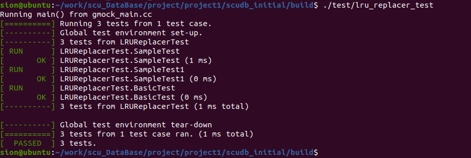
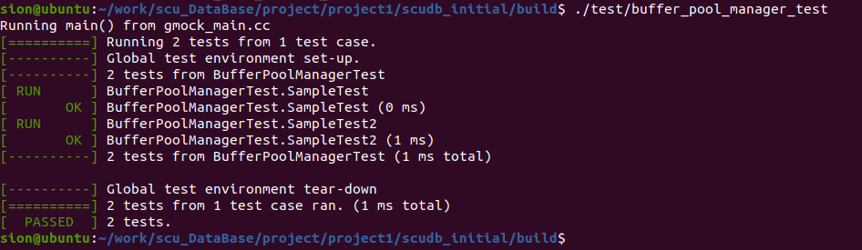

# 数据库系统课程作业

- 姓名：尤敬斌
- 学号：2019141420246

# 作业
- 作业1地址：https://github.com/AkiiLucky/scu_DataBase/blob/main/homework/homework1/homework1.zip
- 作业2地址：课堂上已提交

# 实验
- 实验1地址：https://github.com/AkiiLucky/scu_DataBase/tree/main/project/project1
  - extendible_hash_test
  - lru_replacer_test
  - buffer_pool_manager_test
- 实验2地址：https://github.com/AkiiLucky/scu_DataBase/tree/main/project/project2
  - b_plus_tree_page_test 
  - b_plus_tree_test 
  - b_plus_tree_insert_test
  - b_plus_tree_delete_test
  - b_plus_tree_concurrent_test
  - b_plus_tree_print_test 

